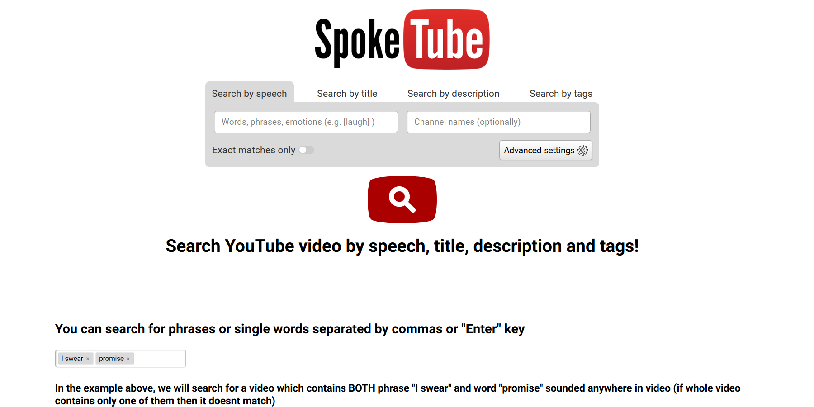
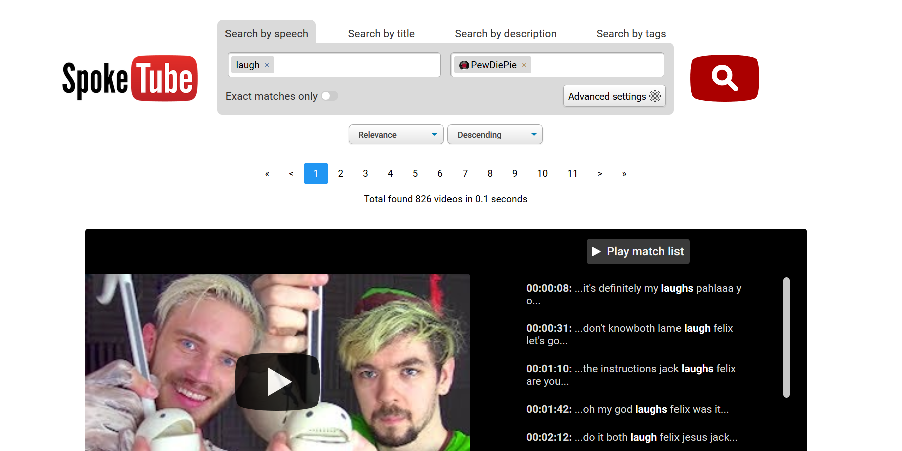

# Spoketube

A Django-based search platform that indexes YouTube channels and lets users search **inside video subtitles**, not just titles and descriptions.

---

## Screenshots

**Landing page** — search form, channel statistics, top channels with subscriber counts.

  

**Search page** — speech matches with highlighted phrases, per-match timestamps, result pagination, channel/date/duration filters.

  

---

## Project overview

Spoketube is a vertical search engine for YouTube content. Instead of searching only by video title or description, it ingests channel metadata and video captions from the YouTube Data API, stores them in a relational database, and indexes the subtitle text in a full-text search engine. A user can then type a phrase and see which videos actually *say* those words, with clickable timestamps that jump to the moment of speech.

Originally built and operated as a single-person project in 2019–2020.

---

## My role

This was a **solo-developed** project. One person was responsible for:

- Backend application and domain model (Django, MySQL).
- Data ingestion pipeline: YouTube Data API client, subtitle scraping, quota accounting, proxy rotation.
- Search layer: Sphinx full-text search integration and a hand-written search module over captions, titles, descriptions, tags.
- Admin surface: custom Django admin for queueing and monitoring parser tasks.
- Frontend integration: templates, a small amount of JavaScript, Bootstrap-based layout, AJAX pagination and autocomplete.
- Deployment: AWS Elastic Beanstalk configuration, static asset pipeline to S3/CloudFront, SES-based email, cron configuration, HTTPS setup.

---

## Core capabilities

- **Channel and video storage.** Structured tables for YouTube channels, videos, caption payloads, parser task history, API quota usage, and proxy pool.
- **Subtitle / speech search.** Full-text search across video subtitles with stemming, exact-match option, match highlighting, and per-match timestamps. Results page links directly into the video at the moment of speech.
- **Metadata search and filtering.** Search by title, description, tags, channel, publication date range, and video duration range. Multi-channel filtering via a tag input.
- **Channel statistics on the landing page.** Top channels by subscriber count with AJAX-loaded "show more" pagination.
- **Ingestion / parser workflow.** Admin queues typed tasks (`add_channel`, `update_channel`, `refresh_channel`, `add_video`, `update_video`, `get_missed_videos`); a cron-driven worker picks up the next task, tracks status, and accounts for YouTube API quota cost.
- **Caption acquisition layer with proxy support** for handling temporary rate limits and access failures.
- **Contact form** with reCAPTCHA and SES delivery, and standard 404/500 pages.

---

## Tech stack

- **Language / framework:** Python 3, Django 2.2
- **Database:** MySQL (AWS RDS in the historical deployment)
- **Full-text search:** Sphinx (accessed via the MySQL wire protocol)
- **External APIs:** YouTube Data API v3, Google reCAPTCHA, Clicky analytics
- **Cloud / deployment:** AWS Elastic Beanstalk, S3, CloudFront, SES
- **Frontend:** Django templates, Bootstrap, vanilla JavaScript, Tagify for multi-value inputs
- **Ops:** Apache + mod_wsgi (EB platform default), cron, django-compressor for CSS/JS

---

## Architecture summary

- `spoketube/` — Django project package: settings, URL routing, WSGI entrypoint, custom S3 storage backend for static files.
- `mainapp/` — Main Django app: ORM models, views, forms, custom admin site, search module, speech (subtitle) parser, template tags, templates, and static assets.
- `data_parser/` — Standalone Python package used both by the web app and by cron jobs. Contains the YouTube Data API client, caption scraper, proxy pool helper, and the two cron entry points (`parser_tasks_handler.py`, `cron_channels_updater.py`).
- `mainapp/search_module.py` — Sphinx QL builder and result hydrator. Turns user search parameters into a Sphinx query, pages and orders the results, and merges them back with the ORM videos.
- `mainapp/speech_parser.py` — Match extraction inside subtitles: stemming, highlighting, words-around windowing, and timestamp lookup.
- `.ebextensions/` — Elastic Beanstalk configuration: Apache/SSL setup, HTTP→HTTPS redirect, cron wiring, log folder creation, and `collectstatic`/`compress` container commands.
- A concise design walkthrough lives in [`docs/ARCHITECTURE.md`](docs/ARCHITECTURE.md).

---

## Deployment / infrastructure notes

Historically this project was deployed on **AWS Elastic Beanstalk** (Python platform, Apache + mod_wsgi) with:

- **RDS MySQL** for application data.
- **S3 + CloudFront** for static assets, via a custom `StaticToS3Storage` backend and `django-compressor` for offline CSS/JS compression.
- **SES** for outbound email (admin notifications, contact form).
- **Cron** on the EC2 instance, running the parser task handler every minute and a channel updater at midnight.
- **HTTPS** terminated on the instance via Apache with certificates pulled from a private S3 bucket during deploy.

Configuration files for all of the above are preserved under `.ebextensions/`. Account-specific values and secrets are not committed — they were provided at deploy time through Elastic Beanstalk environment variables or, for local runs, through a `dev/secrets` INI file (ignored by `.gitignore`).

Dependencies in `requirements.txt` are pinned to their original 2019-era versions (Django 2.2, Python 3.6).

---

## How to run (historical / best-effort)

This project was authored against Python 3.6 / Django 2.2 / Sphinx and an AWS-backed environment. It is **not expected to run out of the box today** on a modern machine. If you want to spin it up locally for inspection, you would approximately:

1. Create a Python 3.6/3.7 virtual environment and install `requirements.txt`.
2. Provide a `dev/secrets` INI file with a `[DEBUG LOCALHOST]` section that defines at least:
   - `DJANGO_SECRET_KEY`, `ALLOWED_HOSTS`
   - `RDS_DB_NAME`, `RDS_USERNAME`, `RDS_PASSWORD`, `RDS_HOSTNAME`, `RDS_PORT`
   - `SPHINX_HOST`, `SPHINX_PORT`
   - `AWS_CLOUDFRONT_DOMAIN`, `AWS_CLOUDFRONT_ID`, `AWS_STORAGE_BUCKET_NAME`, `AWS_S3_REGION`, `AWS_S3_ACCESS_KEY_ID`, `AWS_S3_SECRET_ACCESS_KEY`
   - `AWS_SES_ACCESS_KEY_ID`, `AWS_SES_SECRET_ACCESS_KEY`, `AWS_SES_REGION_NAME`, `AWS_SES_REGION_ENDPOINT`
   - `RECAPTCHA_PUBLIC_KEY`, `RECAPTCHA_PRIVATE_KEY`, `CLICKY_SITE_ID`
   - `YT_DEV_KEY`, `YT_DAY_QUOTAS`, `YT_ENABLE_PROXY`
   - `SEARCH_RESULTS_P_PAGE`, `SEARCH_MAX_SPEECH_MATCHES`, `SEARCH_SPEECH_AROUND`, `MAIN_COUNT_STATISTIC_CHANNELS`
   - `ENABLE_PARSER_TASKS_HANDLER`
3. Have a MySQL database and a Sphinx instance (with a `videos` real-time index) reachable from those credentials.
4. Run `python manage.py migrate` and `python manage.py runserver`.

---

## Status

Historical personal project.  
Sensitive runtime configuration has been replaced with example files.  
Original project period: 2019-2020  
Repository status: sanitized source snapshot.
